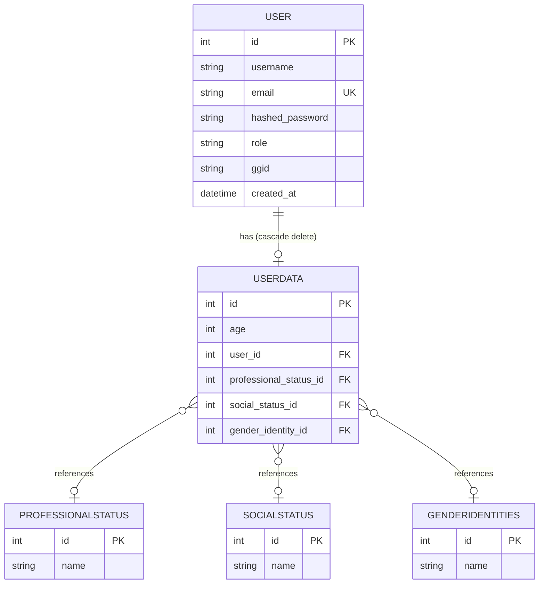
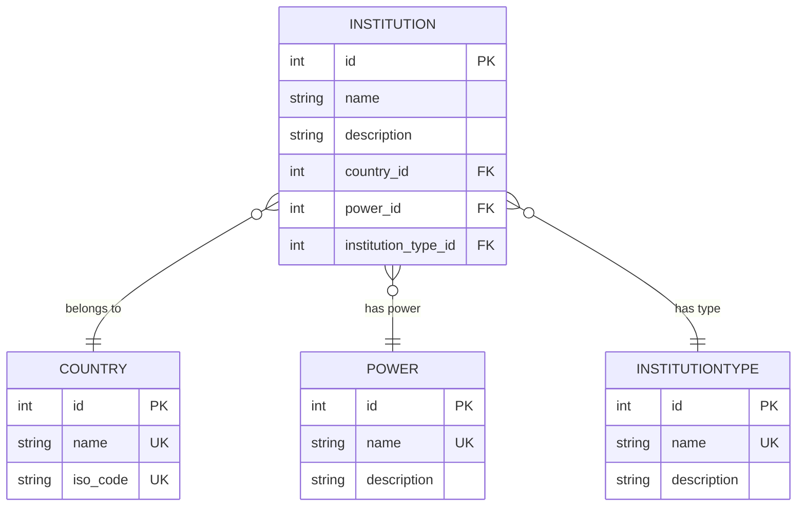
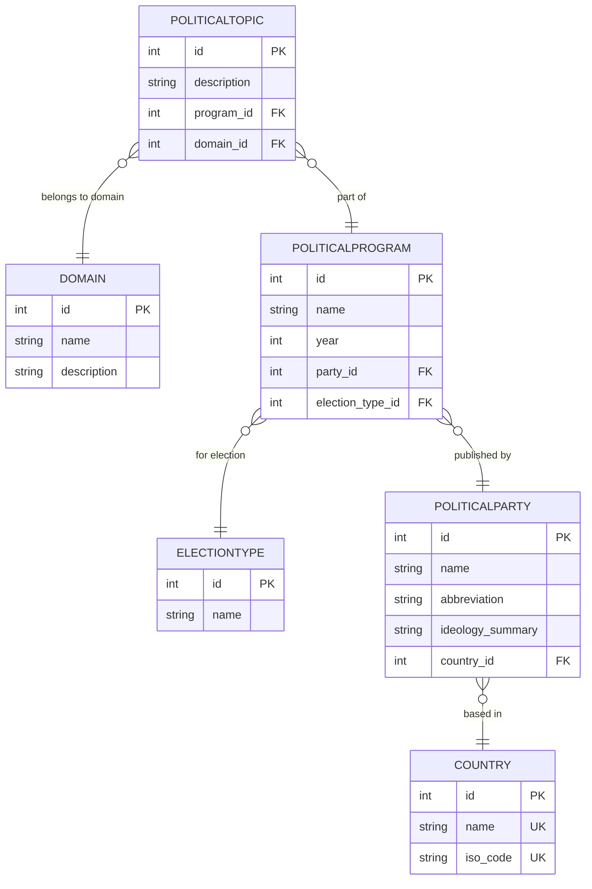
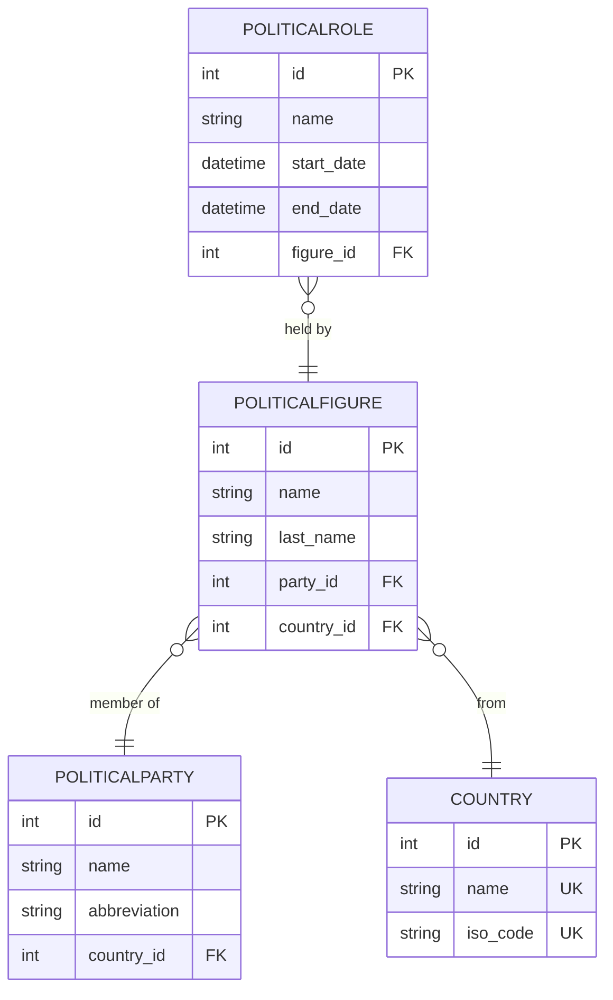
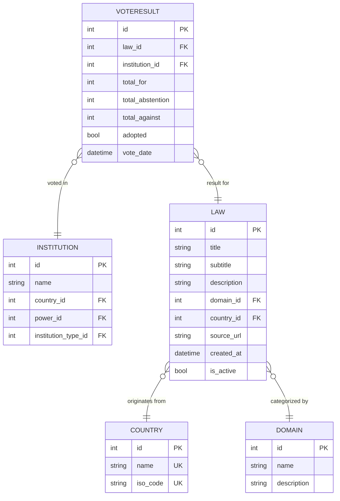
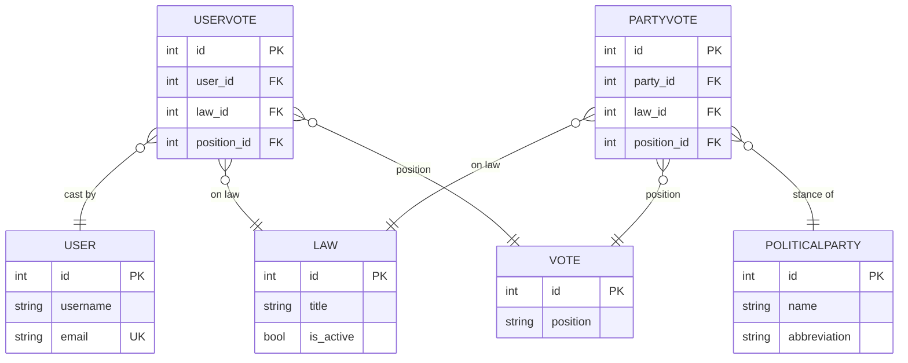
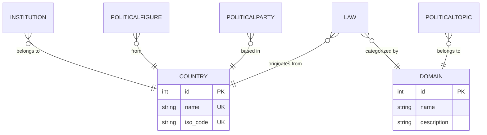

# 🗄️ Schémas Relationnels — Présentation

> Schémas découpés par module fonctionnel pour une intégration facilitée en présentation.

---

## 1️⃣ Module `users` — Profil & Données Utilisateur

> Tables : `user`, `userdata`, `professionalstatus`, `socialstatus`, `genderidentities`

---

## 2️⃣ Module `institution` — Institutions & Pouvoirs

> Tables : `institution`, `institutiontype`, `power`, `country`

---

## 3️⃣ Module `political_party` — Partis & Programmes Politiques

> Tables : `politicalparty`, `politicalprogram`, `electiontype`, `politicaltopic`, `domain`, `country`

---

## 4️⃣ Module `political_figure` — Personnalités Politiques

> Tables : `politicalfigure`, `politicalrole`, `politicalparty`, `country`

---

## 5️⃣ Module `law` — Lois & Résultats de Vote

> Tables : `law`, `voteresult`, `institution`, `domain`, `country`

---

## 6️⃣ Module `user_vote` — Votes Citoyens & Positions des Partis

> Tables : `uservote`, `partyvote`, `user`, `law`, `vote`, `politicalparty`

---

## 🔑 Table Pivot — `country` & `domain`

> Ces deux tables servent de référentiel partagé entre plusieurs modules.

