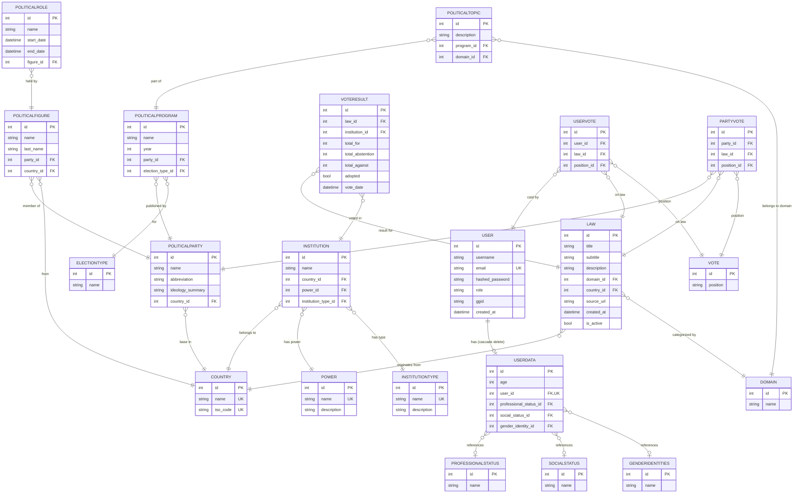

# 🗄️ Base de Données & Migrations Alembic

Ce projet utilise **Alembic** pour gérer les évolutions de la base de données PostgreSQL. Contrairement à une création automatique brute, Alembic permet de modifier la structure de la base sans perdre les données existantes.

---

## 📊 Schéma Relationnel



---

## 📋 Détail des Tables

### Table `user`
| Colonne | Type | Contraintes | Description |
| :--- | :--- | :--- | :--- |
| `id` | `INTEGER` | PK, Auto-increment | Identifiant unique |
| `username` | `VARCHAR` | NOT NULL, INDEX | Nom d'utilisateur |
| `email` | `VARCHAR` | NOT NULL, UNIQUE, INDEX | Adresse email |
| `hashed_password` | `VARCHAR` | NOT NULL | Bcrypt hash du mot de passe |
| `role` | `VARCHAR` | NOT NULL, INDEX | `user` ou `admin` |
| `ggid` | `VARCHAR` | NULLABLE | Google ID (OAuth) |
| `created_at` | `TIMESTAMP` | NOT NULL, DEFAULT now() | Date de création |

### Table `userdata`
| Colonne | Type | Contraintes | Description |
| :--- | :--- | :--- | :--- |
| `id` | `INTEGER` | PK, Auto-increment | Identifiant unique |
| `age` | `INTEGER` | NULLABLE | Âge de l'utilisateur |
| `user_id` | `INTEGER` | FK → `user.id`, UNIQUE | Lien 1:1 vers l'utilisateur |
| `professional_status_id` | `INTEGER` | FK → `professionalstatus.id`, NULLABLE | Statut professionnel |
| `social_status_id` | `INTEGER` | FK → `socialstatus.id`, NULLABLE | Statut social |
| `gender_identity_id` | `INTEGER` | FK → `genderidentities.id`, NULLABLE | Identité de genre |

### Table `professionalstatus`
| Colonne | Type | Contraintes | Description |
| :--- | :--- | :--- | :--- |
| `id` | `INTEGER` | PK, Auto-increment | Identifiant unique |
| `name` | `VARCHAR` | INDEX | Libellé du statut |

### Table `socialstatus`
| Colonne | Type | Contraintes | Description |
| :--- | :--- | :--- | :--- |
| `id` | `INTEGER` | PK, Auto-increment | Identifiant unique |
| `name` | `VARCHAR` | INDEX | Libellé du statut |

### Table `genderidentities`
| Colonne | Type | Contraintes | Description |
| :--- | :--- | :--- | :--- |
| `id` | `INTEGER` | PK, Auto-increment | Identifiant unique |
| `name` | `VARCHAR` | INDEX | Libellé de l'identité |

### Table `country` 🆕
| Colonne | Type | Contraintes | Description |
| :--- | :--- | :--- | :--- |
| `id` | `INTEGER` | PK, Auto-increment | Identifiant unique |
| `name` | `VARCHAR` | UNIQUE, INDEX | Nom du pays |
| `iso_code` | `VARCHAR` | UNIQUE, INDEX | Code ISO du pays (ex: `FR`, `US`) |

### Table `power` 🆕
| Colonne | Type | Contraintes | Description |
| :--- | :--- | :--- | :--- |
| `id` | `INTEGER` | PK, Auto-increment | Identifiant unique |
| `name` | `VARCHAR` | UNIQUE, INDEX | Nom du pouvoir (ex: Exécutif, Législatif) |
| `description` | `VARCHAR` | NULLABLE | Description du pouvoir |

### Table `institutiontype` 🆕
| Colonne | Type | Contraintes | Description |
| :--- | :--- | :--- | :--- |
| `id` | `INTEGER` | PK, Auto-increment | Identifiant unique |
| `name` | `VARCHAR` | UNIQUE, INDEX | Nom du type d'institution |
| `description` | `VARCHAR` | NULLABLE | Description du type |

### Table `institution` 🆕
| Colonne | Type | Contraintes | Description |
| :--- | :--- | :--- | :--- |
| `id` | `INTEGER` | PK, Auto-increment | Identifiant unique |
| `name` | `VARCHAR` | INDEX | Nom de l'institution |
| `description` | `VARCHAR` | NULLABLE | Description de l'institution |
| `country_id` | `INTEGER` | FK → `country.id`, INDEX | Pays de rattachement |
| `power_id` | `INTEGER` | FK → `power.id`, INDEX | Pouvoir associé |
| `institution_type_id` | `INTEGER` | FK → `institutiontype.id`, INDEX | Type d'institution |

### Table `politicalfigure` 🆕
| Colonne | Type | Contraintes | Description |
| :--- | :--- | :--- | :--- |
| `id` | `INTEGER` | PK, Auto-increment | Identifiant unique |
| `name` | `VARCHAR` | INDEX | Prénom |
| `last_name` | `VARCHAR` | INDEX | Nom de famille |
| `party_id` | `INTEGER` | FK → `politicalparty.id` | Parti d'appartenance |
| `country_id` | `INTEGER` | FK → `country.id` | Pays d'attache |

### Table `politicalrole` 🆕
| Colonne | Type | Contraintes | Description |
| :--- | :--- | :--- | :--- |
| `id` | `INTEGER` | PK, Auto-increment | Identifiant unique |
| `name` | `VARCHAR` | INDEX | Intitulé du rôle |
| `start_date` | `TIMESTAMP` | NOT NULL | Date de début |
| `end_date` | `TIMESTAMP` | NULLABLE | Date de fin |
| `figure_id` | `INTEGER` | FK → `politicalfigure.id` | Personnalité concernée |

### Table `politicalparty` 🆕
| Colonne | Type | Contraintes | Description |
| :--- | :--- | :--- | :--- |
| `id` | `INTEGER` | PK, Auto-increment | Identifiant unique |
| `name` | `VARCHAR` | INDEX | Nom du parti |
| `abbreviation` | `VARCHAR` | NULLABLE, INDEX | Acronyme |
| `country_id` | `INTEGER` | FK → `country.id` | Pays |

### Table `politicalprogram` 🆕
| Colonne | Type | Contraintes | Description |
| :--- | :--- | :--- | :--- |
| `id` | `INTEGER` | PK, Auto-increment | Identifiant unique |
| `name` | `VARCHAR` | INDEX | Titre du programme |
| `year` | `INTEGER` | INDEX | Année de l'élection |
| `party_id` | `INTEGER` | FK → `politicalparty.id` | Parti porteur |
| `election_type_id` | `INTEGER` | FK → `electiontype.id` | Type d'élection |

### Table `politicaltopic` 🆕
| Colonne | Type | Contraintes | Description |
| :--- | :--- | :--- | :--- |
| `id` | `INTEGER` | PK, Auto-increment | Identifiant unique |
| `description` | `TEXT` | NOT NULL | Détail de la proposition |
| `program_id` | `INTEGER` | FK → `politicalprogram.id` | Programme parent |
| `domain_id` | `INTEGER` | FK → `domain.id` | Thématique (Économie, etc.) |

### Table `domain` 🆕
| Colonne | Type | Contraintes | Description |
| :--- | :--- | :--- | :--- |
| `id` | `INTEGER` | PK, Auto-increment | Identifiant unique |
| `name` | `VARCHAR` | INDEX | Nom du domaine (ex: Santé) |
| `description` | `VARCHAR` | NULLABLE | Description du domaine |

### Table `electiontype` 🆕
| Colonne | Type | Contraintes | Description |
| :--- | :--- | :--- | :--- |
| `id` | `INTEGER` | PK, Auto-increment | Identifiant unique |
| `name` | `VARCHAR` | NOT NULL | Nom du type (ex: Présidentielle) |

### Table `law` 🆕
| Colonne | Type | Contraintes | Description |
| :--- | :--- | :--- | :--- |
| `id` | `INTEGER` | PK, Auto-increment | Identifiant unique |
| `title` | `VARCHAR` | NOT NULL, INDEX | Titre de la loi |
| `subtitle` | `VARCHAR` | NULLABLE | Sous-titre |
| `description` | `TEXT` | NOT NULL | Texte ou résumé de la loi |
| `domain_id` | `INTEGER` | FK → `domain.id`, INDEX | Thématique |
| `country_id` | `INTEGER` | FK → `country.id`, INDEX | Pays |
| `source_url` | `VARCHAR` | NULLABLE, INDEX | Lien vers le texte officiel |
| `created_at` | `TIMESTAMP` | NOT NULL | Date d'ajout |
| `is_active` | `BOOLEAN` | DEFAULT TRUE | Si la loi est toujours en vigueur |

### Table `vote` 🆕
| Colonne | Type | Contraintes | Description |
| :--- | :--- | :--- | :--- |
| `id` | `INTEGER` | PK, Auto-increment | Identifiant unique |
| `position` | `VARCHAR` | UNIQUE, INDEX | Position (ex: Pour, Contre, Abstention) |

### Table `voteresult` 🆕
| Colonne | Type | Contraintes | Description |
| :--- | :--- | :--- | :--- |
| `id` | `INTEGER` | PK, Auto-increment | Identifiant unique |
| `law_id` | `INTEGER` | FK → `law.id`, INDEX | Loi concernée |
| `institution_id` | `INTEGER` | FK → `institution.id`, INDEX | Institution ayant voté |
| `total_for` | `INTEGER` | NOT NULL | Voix pour |
| `total_abstention` | `INTEGER` | NOT NULL | Abstentions |
| `total_against` | `INTEGER` | NOT NULL | Voix contre |
| `adopted` | `BOOLEAN` | NOT NULL | Résultat (Adoptée ou non) |
| `vote_date` | `TIMESTAMP` | NOT NULL | Date du scrutin |

### Table `uservote` 🆕
| Colonne | Type | Contraintes | Description |
| :--- | :--- | :--- | :--- |
| `id` | `INTEGER` | PK, Auto-increment | Identifiant unique |
| `user_id` | `INTEGER` | FK → `user.id`, INDEX | Utilisateur |
| `law_id` | `INTEGER` | FK → `law.id`, INDEX | Loi |
| `position_id` | `INTEGER` | FK → `vote.id`, INDEX | Position choisie |

### Table `partyvote` 🆕
| Colonne | Type | Contraintes | Description |
| :--- | :--- | :--- | :--- |
| `id` | `INTEGER` | PK, Auto-increment | Identifiant unique |
| `party_id` | `INTEGER` | FK → `politicalparty.id`, INDEX | Parti |
| `law_id` | `INTEGER` | FK → `law.id`, INDEX | Loi |
| `position_id` | `INTEGER` | FK → `vote.id`, INDEX | Consigne de vote |

---

## 🔗 Relations

| Relation | Type | Comportement |
| :--- | :--- | :--- |
| `User` → `UserData` | 1:1 (optionnel) | **Cascade delete** : supprimer un user supprime ses données |
| `UserData` → `ProfessionalStatus` | N:1 (optionnel) | Référence simple (pas de cascade) |
| `UserData` → `SocialStatus` | N:1 (optionnel) | Référence simple (pas de cascade) |
| `UserData` → `GenderIdentities` | N:1 (optionnel) | Référence simple (pas de cascade) |
| `Institution` → `Country` | N:1 (obligatoire) | Chaque institution appartient à un pays |
| `Institution` → `Power` | N:1 (obligatoire) | Chaque institution est liée à un pouvoir |
| `Institution` → `InstitutionType` | N:1 (obligatoire) | Chaque institution a un type |
| `PoliticalFigure` → `PoliticalParty`| N:1 (obligatoire) | Appartenance partisane |
| `PoliticalRole` → `PoliticalFigure` | N:1 (obligatoire) | Historique des rôles |
| `PoliticalProgram` → `PoliticalParty`| N:1 (obligatoire) | Programme d'un parti |
| `PoliticalTopic` → `Domain` | N:1 (obligatoire) | Thématique d'une proposition |
| `Law` → `Country` | N:1 (obligatoire) | Origine d'une loi |
| `Law` → `Domain` | N:1 (obligatoire) | Catégorie législative |
| `VoteResult` → `Law` | N:1 (obligatoire) | Scrutin sur une loi |
| `VoteResult` → `Institution` | N:1 (obligatoire) | Vote par institution |
| `UserVote` → `User` | N:1 (obligatoire) | Participation utilisateur |
| `UserVote` → `Law` | N:1 (obligatoire) | Vote sur un texte |
| `UserVote` → `Vote` | N:1 (obligatoire) | Position du vote |
| `PartyVote` → `PoliticalParty` | N:1 (obligatoire) | Position du parti |
| `PartyVote` → `Law` | N:1 (obligatoire) | Consigne sur une loi |

---

## 🚀 Workflow Rapide (Usage Quotidien)

Dès que vous modifiez un fichier `model.py` dans vos modules :

### 1. Générer une nouvelle migration
Une fois le docker en route (`docker compose up -d`), lancez la commande suivante :
```bash
docker compose exec backend python -m alembic revision --autogenerate -m "description de mon changement"
```
*Ceci va créer un nouveau script dans `migrations/versions/`.*

### 2. Appliquer les changements
Pour mettre à jour votre base de données locale (ou en production) :
```bash
docker compose exec backend python -m alembic upgrade head
```

---

## 🧐 Comprendre le fonctionnement

### Pourquoi Alembic ?
- **Historique** : Chaque changement est stocké dans Git.
- **Sécurité** : On ne supprime pas la base pour la recréer, on l'adapte.
- **Production** : On peut déployer des changements de schéma en toute confiance.

### Configuration du projet
- **Fichier `alembic.ini`** : Contient les réglages de base.
- **Fichier `migrations/env.py`** : C'est le cerveau de la migration. Il a été configuré pour :
    - Charger l'URL de la base de données directement depuis le fichier `.env`.
    - Détecter automatiquement les modèles **SQLModel** définis dans les modules.

---

## 🛠️ Commandes Utiles

| Commande | Description |
| :--- | :--- |
| `alembic history` | Affiche la liste chronologique des migrations. |
| `alembic current` | Affiche la version actuelle de votre base de données. |
| `alembic upgrade +1` | Applique uniquement la migration suivante. |
| `alembic downgrade -1` | Annule la dernière migration appliquée (Attention !). |

---

## ⚠️ Bonnes Pratiques & Erreurs Courantes

### 🔍 Relire les scripts générés
Alembic est puissant mais automatique. Avant de faire un `upgrade head`, ouvrez toujours le fichier généré dans `migrations/versions/` pour vérifier qu'il ne va pas supprimer une colonne par erreur (ex: si vous avez renommé un champ).

### ❌ Erreur : "Can't locate revision identified by 'xxxx'"

Cette erreur arrive quand la table `alembic_version` dans votre base de données pointe vers un ID de révision qui **n'existe plus** dans le dossier `migrations/versions/`.

**Causes fréquentes :**
- Un merge Git qui a supprimé ou remplacé des fichiers de migration
- Une suppression manuelle de fichiers dans `migrations/versions/`
- Un collègue qui a regénéré ses migrations sur une autre branche

**Procédure de résolution complète (4 étapes) :**

#### Étape 1 — Supprimer la table `alembic_version`
```bash
docker exec edupo-db-1 psql -U superadmin -d edupo_db -c "DROP TABLE IF EXISTS alembic_version CASCADE;"
```

#### Étape 2 — Resynchroniser Alembic avec l'état actuel de la DB
Cette commande dit à Alembic : *"La base est déjà à jour jusqu'à la dernière migration existante, ne rejoue rien."*
```bash
docker exec edupo-backend-1 alembic stamp head
```
> ⚠️ **Cette étape est cruciale !** Sans elle, Alembic essaierait de rejouer **toutes** les migrations depuis le début, ce qui échouerait car les tables existent déjà.

#### Étape 3 — Générer la nouvelle migration
```bash
docker exec edupo-backend-1 alembic revision --autogenerate -m "description du changement"
```

#### Étape 4 — Appliquer la migration
```bash
docker exec edupo-backend-1 alembic upgrade head
```

#### Vérification
Pour confirmer que tout est en ordre :
```bash
# Voir la version actuelle de la DB
docker exec edupo-backend-1 alembic current

# Voir l'historique complet des migrations
docker exec edupo-backend-1 alembic history
```

---

### 🔄 Que se passe-t-il si je renomme une colonne ?
**Attention !** Alembic `--autogenerate` ne détecte pas bien les renommages. Par défaut, il va :
1. **Supprimer** l'ancienne colonne (vous perdez vos données !).
2. **Créer** une nouvelle colonne vide.

**La méthode pro pour renommer :**
1. Générez la migration : `python -m alembic revision --autogenerate -m "rename col"`.
2. Ouvrez le fichier généré dans `migrations/versions/`.
3. Remplacez les lignes `op.drop_column` et `op.add_column` par une seule ligne :
   ```python
   op.alter_column('nom_table', 'ancien_nom', new_column_name='nouveau_nom')
   ```

---

### 📦 Ajout d'un nouveau module

Si vous créez un nouveau module (ex: `app/modules/mon_module`), **deux fichiers** doivent être mis à jour pour qu'Alembic détecte vos nouveaux modèles :

#### 1. `app/modules/mon_module/__init__.py`
Exporter le(s) modèle(s) depuis le module :
```python
from .model import MonModel
```

#### 2. `app/modules/__init__.py`
Importer le modèle dans le `__init__.py` racine des modules :
```python
from .mon_module import MonModel
```

#### 3. `migrations/env.py`
Vérifier que la ligne d'import inclut le nouveau modèle :
```python
from app.modules import User, ..., MonModel
```

> 💡 **Astuce** : Si Alembic génère une migration vide (`pass`) alors que vous avez ajouté un nouveau modèle, c'est probablement parce que l'import est manquant dans `env.py` ou dans le `__init__.py` du module.

