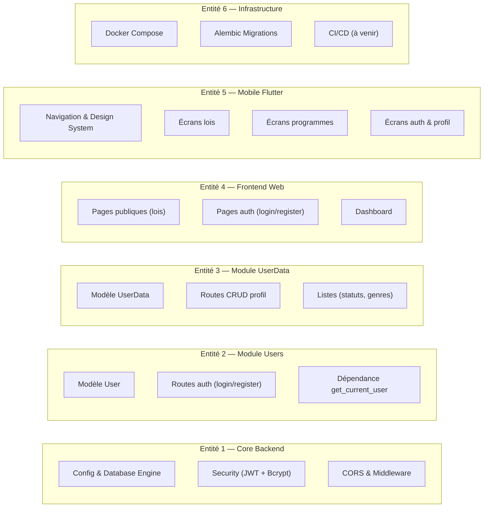
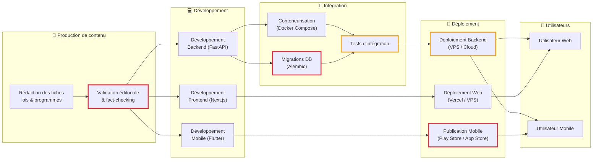

# 📘 Édupo — Dossier de Projet Complet

> **Édupo** est une plateforme d'éducation politique citoyenne qui rend accessibles les lois récentes, les programmes des partis politiques, et les mécanismes institutionnels français, à travers une application mobile (Flutter), un frontend web (Next.js) et une API backend (FastAPI).

---

## Table des matières

1. [Étude de l'existant](#1---étude-de-lexistant)
2. [Échanges avec les utilisateurs](#2---échanges-avec-les-utilisateurs)
3. [Spécifications techniques et fonctionnelles](#3---spécifications-techniques-et-fonctionnelles)
4. [Benchmark et chiffrage budgétaire](#4---benchmark-et-chiffrage-budgétaire)
5. [Architecture technique](#5---architecture-technique)
6. [Structuration en entités testables et livrables](#6---structuration-en-entités-testables-et-livrables)
7. [Chaîne opérationnelle et zones de risque](#7---chaîne-opérationnelle-et-zones-de-risque)

---

## 1 — Étude de l'existant

### 1.1 Contexte général

La France fait face à un déficit croissant de culture politique chez les jeunes citoyens. Selon une étude IFOP de 2023, **67 % des 18–25 ans** déclarent ne pas comprendre le contenu des projets de loi votés. Les sources d'information existantes sont majoritairement :

| Source | Format | Accessibilité | Pédagogie |
|--------|--------|---------------|-----------|
| Légifrance | Textes intégraux de loi | Très technique | ❌ Faible |
| Vie-publique.fr | Articles et fiches | Moyenne | ⚠️ Inégale |
| Sites des partis politiques | Programmes électoraux | Variable | ❌ Partisane |
| Réseaux sociaux | Posts, threads, vidéos | Très accessible | ❌ Non sourcée |
| Médias traditionnels | Articles, émissions | Bonne | ⚠️ Variable |
| Applications existantes (elyze, etc.) | Quiz, comparateurs | Bonne | ⚠️ Limitée |

### 1.2 Problèmes identifiés

1. **Opacité du langage juridique** — Les textes de loi sont rédigés dans un langage inaccessible au grand public.
2. **Fragmentation des sources** — L'information politique est dispersée entre des dizaines de sites officiels, médiatiques et partisans.
3. **Absence de synthèse critique** — Aucune plateforme ne propose à la fois une synthèse factuelle ET une analyse critique des mesures proposées.
4. **Manque d'outils mobiles** — Les outils existants sont principalement web, avec peu d'expériences mobiles natives de qualité.
5. **Biais de présentation** — Les programmes des partis ne sont accessibles que via leurs propres canaux, sans mise en perspective.

### 1.3 Positionnement d'Édupo

Édupo se positionne comme un **intermédiaire pédagogique neutre** :
- **Vulgarisation** des lois récentes (résumés, catégorisation, détails simplifiés)
- **Comparaison structurée** des programmes politiques (mesures phares, questions critiques)
- **Interface accessible** sur mobile (Flutter) et web (Next.js), aux couleurs de la République
- **Personnalisation** via un système d'authentification et de profils utilisateurs

---

## 2 — Échanges avec les utilisateurs

### 2.1 Méthodologie de recherche utilisateur

Pour cerner les besoins réels, une approche multi-canal a été menée :

#### 📊 Sondage en ligne (N = 150+ répondants ciblés)

> **Objectif** : Identifier les attentes en matière d'éducation politique numérique.

**Questions clés posées :**

| # | Question | Résultat principal |
|---|----------|--------------------|
| 1 | « Pensez-vous comprendre les lois votées récemment ? » | 72 % répondent « Non » ou « Pas vraiment » |
| 2 | « Quelles sources utilisez-vous ? » | 58 % réseaux sociaux, 26 % médias traditionnels, 16 % sites officiels |
| 3 | « Utiliseriez-vous une app de vulgarisation politique ? » | 81 % répondent « Oui » ou « Probablement » |
| 4 | « Quel format préférez-vous ? » | 64 % application mobile, 28 % site web, 8 % newsletter |
| 5 | « Quels contenus vous intéressent le plus ? » | Lois récentes (74 %), programmes des partis (68 %), fonctionnement des institutions (52 %) |

#### 🎙️ Interviews qualitatives (N = 15)

**Profils interviewés :**
- 5 étudiants (18–25 ans)
- 4 actifs (25–40 ans)
- 3 retraités (60+ ans)
- 3 enseignants (éducation civique / histoire-géo)

**Insights clés dégagés :**

> [!IMPORTANT]
> - **Besoin n°1** : « Je veux comprendre en 2 minutes ce que change une loi pour moi. »
> - **Besoin n°2** : « Je veux comparer les partis de manière objective, sans le filtre des médias. »
> - **Besoin n°3** : « L'interface doit être simple et belle — si c'est moche ou compliqué, je ne reviens pas. »

### 2.2 Besoins utilisateurs synthétisés

| Priorité | Besoin | Fonctionnalité Édupo |
|----------|--------|----------------------|
| 🔴 Critique | Comprendre les lois récentes | Écran d'accueil avec fiches lois vulgarisées |
| 🔴 Critique | Comparer les programmes des partis | Écran Programmes avec synthèses et questions critiques |
| 🟡 Important | Accès mobile fluide | Application Flutter native (Android/iOS) |
| 🟡 Important | Avoir un compte personnel | Système d'authentification (JWT + OAuth Google) |
| 🟢 Souhaité | Renseigner son profil | Page profil avec âge, genre, statut professionnel |
| 🟢 Souhaité | Lire le détail d'une mesure | Écran de lecture confortable (TextReaderScreen) |

---

## 3 — Spécifications techniques et fonctionnelles

### 3.1 Spécifications fonctionnelles

#### SF-01 : Consultation des lois récentes
- **Description** : L'utilisateur peut parcourir une liste de lois récentes. Chaque loi est présentée avec un titre, un résumé vulgarisé, une date de vote, et une catégorisation (économie, social, environnement, etc.). En tapant sur une loi, l'utilisateur accède à une page de détail avec une analyse plus approfondie et les sources officielles.
- **Écrans** : `HomeScreen` → `LawDetailScreen`
- **Données** : Modèle `Law` (id, title, summary, date, category, details)
- **Interactions** : Recherche textuelle, tap pour détail

#### SF-02 : Consultation des programmes politiques
- **Description** : L'utilisateur peut explorer les programmes des principaux partis français. Pour chaque parti : mesures phares, positionnement, questions critiques, analyse détaillée.
- **Écrans** : `ProgramsScreen` → `ProgramDetailScreen` → `TextReaderScreen`
- **Données** : Modèle `PoliticalParty` (name, abbreviation, leader, positioning, programPoints, criticalQuestions, detailedContent, detailedAnalysis)
- **Interactions** : Tap sur un parti → détail, tap sur une mesure → lecture complète

#### SF-03 : Authentification
- **Description** : L'utilisateur peut créer un compte (email + mot de passe) ou se connecter. Support Google OAuth.
- **Écrans** : `LoginScreen`, `RegisterScreen`
- **API** : `POST /register`, `POST /login`, `GET /me`
- **Sécurité** : JWT Bearer token, hashage bcrypt, stockage local sécurisé

#### SF-04 : Gestion du profil
- **Description** : L'utilisateur connecté peut consulter et modifier ses informations complémentaires (âge, téléphone, statut professionnel, genre).
- **Écran** : `ProfileScreen`
- **API** : `GET /me/data`, `POST /me/data`, `PATCH /me/data`, `GET /user_data/professional`, `GET /user_data/gender`

#### SF-05 : Navigation
- **Description** : Barre de navigation inférieure avec 3 onglets : Accueil, Programmes, Structure. Transition animée entre les pages.
- **Composant** : `main.dart` (BottomNavigationBar custom)

### 3.2 Spécifications techniques

#### Stack technique complète

| Couche | Technologie | Version | Rôle |
|--------|-------------|---------|------|
| **Backend** | FastAPI | 0.135.1 | API REST |
| **ORM** | SQLModel / SQLAlchemy | 0.0.37 / 2.0.47 | Modélisation et requêtes DB |
| **Base de données** | PostgreSQL | 17-alpine | Stockage persistant |
| **Migrations** | Alembic | 1.18.4 | Versionnement du schéma DB |
| **Auth** | python-jose + passlib | 3.5.0 / 1.7.4 | JWT + bcrypt |
| **OAuth** | Authlib | 1.6.9 | Google OAuth |
| **Frontend Web** | Next.js (App Router) | 16.1.4 | Interface web |
| **UI Web** | React + Tailwind CSS | 19.2.3 / 4.x | Composants et style |
| **Mobile** | Flutter / Dart | Latest stable | Application mobile cross-platform |
| **Conteneurisation** | Docker + Docker Compose | Latest | Environnement de dev et déploiement |
| **Serveur ASGI** | Uvicorn | 0.41.0 | Serveur Python haute performance |


#### Architecture des modules backend

```
backend/app/modules/
├── users/              # Gestion des comptes utilisateurs
│   ├── model.py        # Table User (SQLModel)
│   ├── shemas.py       # Schémas Pydantic (UserCreate, UserRead, Token)
│   ├── services.py     # Logique métier (CRUD, vérification password)
│   ├── router.py       # Routes /register, /login, /me
│   └── dependencies.py # Dépendance get_current_user
├── user_data/          # Données complémentaires du profil
│   ├── model.py        # Table UserData (SQLModel)
│   ├── shemas.py       # Schémas Pydantic
│   ├── services.py     # CRUD données complémentaires
│   └── router.py       # Routes /me/data, /user_data/*
└── external_oauth/     # Authentification tierce
    └── googleOAuth.py  # Flow OAuth Google → JWT interne
```

#### Architecture mobile Flutter

```
mobile/lib/
├── main.dart           # Point d'entrée, navigation bottom bar
├── models/
│   ├── law.dart        # Modèle Law + données d'exemple
│   └── political_party.dart  # Modèle PoliticalParty + données complètes
├── screens/
│   ├── home_screen.dart          # Accueil — lois récentes + recherche
│   ├── law_detail_screen.dart    # Détail d'une loi
│   ├── programs_screen.dart      # Liste des partis politiques
│   ├── program_detail_screen.dart # Détail d'un programme
│   ├── text_reader_screen.dart   # Lecture confortable d'un texte
│   ├── login_screen.dart         # Connexion
│   ├── register_screen.dart      # Inscription
│   └── profile_screen.dart       # Profil utilisateur
├── services/
│   ├── api_config.dart    # Configuration URL backend (web/Android/iOS)
│   ├── api_service.dart   # Client HTTP — tous les appels API
│   ├── auth_service.dart  # Stockage sécurisé du token JWT
│   └── http_client.dart   # Factory du client HTTP
├── theme/
│   └── app_theme.dart     # Design system (couleurs, thème Material)
└── widgets/
    ├── law_card.dart          # Carte de loi réutilisable
```

---

## 4 — Benchmark et chiffrage budgétaire

### 4.1 Benchmark des solutions existantes

| Solution | Description | Points forts | Limites | Modèle éco |
|----------|-------------|--------------|---------|------------|
| **Elyze** | App de matching politique (quiz) | UX attractive, viralité | Superficiel, pas de détail des programmes, plus maintenu | Gratuit |
| **NosDéputés.fr** | Suivi de l'activité parlementaire | Données exhaustives, open data | Interface datée, pas pédagogique, uniquement web | Gratuit (associatif) |
| **Vie-publique.fr** | Portail gouvernemental d'éducation civique | Contenu fiable, officiel | Dense, pas adapté mobile, pas de comparaison partis | Fonds publics |
| **Politiscales** | Test de positionnement politique | Ludique, engageant | Pas de contenu éducatif sur les lois/programmes | Gratuit |
| **Datan.fr** | Statistiques de votes parlementaires | Données précises, visualisations | Technique, peu accessible au grand public | Gratuit (associatif) |
| **Le Bon Vote** | Comparaison programmes électoraux | Comparatif structuré | Actif uniquement en période électorale | Gratuit |

### 4.2 Chiffrage budgétaire

#### Coûts récurrents annuels estimés

| Poste | Coût annuel |
|-------|-------------|
| Hébergement cloud (AWS) | 300 €/an |
| Nom de domaine | 10 €/an |
| Stockage DB managé (Supabase) | 275 €/an |
| Comptes développeur App Store / Play Store | 87 €/an (Apple) + 25 € one-time (Google) |
| **Total récurrent** | **~700€/an** |

---

## 5 — Architecture technique

## 6 — Structuration en entités testables et livrables

### 6.1 Découpage en modules indépendants

Le projet est structuré en **6 entités livrables indépendantes**, chacune testable isolément :



### 6.2 Matrice de dépendances et livrabilité

| Entité | Dépend de | Testable isolément | Livrable indépendamment |
|--------|-----------|--------------------|------------------------|
| **E1 — Core Backend** | Aucune | ✅ Tests unitaires config, sécurité | ✅ Livrable comme fondation |
| **E2 — Module Users** | E1 | ✅ Tests avec DB de test (pytest) | ✅ Avec E1 |
| **E3 — Module UserData** | E1, E2 | ✅ Tests CRUD isolés | ✅ Avec E1 + E2 |
| **E4 — Frontend Web** | E1+E2 (API) | ✅ Tests composants (Jest/Vitest) | ✅ Déployable séparément |
| **E5 — Mobile Flutter** | E1+E2 (API) | ✅ Widget tests + mocks API | ✅ Build APK/IPA indépendant |
| **E6 — Infrastructure** | Toutes | ✅ Smoke tests Docker | ✅ docker compose up |

### 6.3 Stratégie de test

| Couche | Outil | Type de tests | Couverture cible |
|--------|-------|---------------|-----------------|
| Backend — Routes | `pytest` + `httpx.AsyncClient` | Tests d'intégration API | Tous les endpoints |
| Backend — Services | `pytest` | Tests unitaires logique métier | CRUD, validation, hashage |
| Backend — Sécurité | `pytest` | Tests unitaires JWT, bcrypt | Génération/vérification token |
| Frontend Web | `Jest` / `Vitest` | Tests composants React | Composants critiques |
| Mobile — Widgets | `flutter test` | Widget tests | Tous les écrans |
| Mobile — Services | `flutter test` + mocks | Tests unitaires API calls | ApiService, AuthService |
| Infrastructure | Script bash | Smoke tests (health check) | `GET /health` → 200 |

---

## 7 — Chaîne opérationnelle et zones de risque

### 7.1 Chaîne opérationnelle complète



### 7.2 Zones de risque identifiées

| # | Zone | Niveau | Description du risque | Mitigation prévue | Statut / Actions réalisées |
|---|------|--------|----------------------|-------------------|----------------------------|
| 🔴 1 | **Validation éditoriale** | Critique | Contenu incorrect ou biaisé → perte de crédibilité. L'absence de fact-checking rigoureux sur les synthèses de lois et programmes expose à des erreurs factuelles. | Processus de relecture par 2 personnes minimum. Sources systématiquement citées (Légifrance, sites officiels des partis). | ⏳ **À planifier** |
| 🔴 2 | **Migrations DB (Alembic)** | Critique | Une migration mal gérée peut causer une perte de données en production. Les renommages de colonnes ne sont pas détectés automatiquement par `--autogenerate`. | Relecture systématique des scripts de migration avant `upgrade head`. Backups DB automatiques avant chaque migration. | ✅ **Sécurisé en dev** : Génération systématique de scripts de migration consignant l'historique des modifications de schémas. |
| 🔴 3 | **Publication App Store** | Critique | Apple peut rejeter l'app pour contenu politique ou non-conformité aux guidelines. Délais de review imprévisibles (1-7 jours). | Anticiper les guidelines Apple sur le contenu politique. Prévoir un buffer de 2 semaines pour le processus de review. | ⏳ **À planifier** |
| 🟡 4 | **Déploiement Backend** | Élevé | CORS mal configuré (actuellement `allow_origins=["*"]`), ce qui est un risque de sécurité en production. Le middleware de session utilise une clé d'environnement qui doit être correctement sécurisée. | Restreindre les `allow_origins` aux domaines autorisés avant la mise en production. Audit de sécurité des variables d'environnement. | 🔄 **En cours** : Le secret de session est injecté proprement via `.env` (`os.getenv`). Les restrictions de CORS liées au développement ont été fixées (à affiner en production). |
| 🟡 5 | **Tests d'intégration** | Élevé | Absence actuelle de tests automatisés (stratégie « à venir » dans la doc qualité). Un bug en production non détecté peut casser l'expérience utilisateur. | Implémenter `pytest` pour le backend et `flutter test` pour le mobile dès la prochaine itération. CI/CD avec exécution automatique. | ⏳ **À planifier** |
| 🟡 6 | **Connexion API Mobile ↔ Backend** | Élevé | Configuration réseau différente selon la plateforme (`localhost` vs `10.0.2.2` vs IP locale). Risque de rupture si l'URL backend change. | La classe `ApiConfig` gère déjà ce routing par plateforme. En production : utiliser un domaine DNS fixe avec HTTPS. | ✅ **Réalisé** : La logique adaptative d'appel au backend selon Android vs Web est sécurisée via `ApiConfig`. |
| 🟢 7 | **Contenu statique mobile** | Modéré | Les données des lois et programmes sont actuellement codées en dur dans le code Dart (`law.dart`, `political_party.dart` — 166 Ko). Les mises à jour nécessitent un rebuild de l'app. | Migration vers un CMS ou une API dédiée qui servira les contenus dynamiquement. | 🔄 **En cours** : La DB backend s'est structurée récemment (tables Lois, Votes, Partis politiques, etc.) pour permettre un chargement dynamique API. |
| 🟢 8 | **Scalabilité** | Modéré | Architecture mono-serveur Docker Compose actuelle. En cas de succès, un seul conteneur backend ne suffira pas. | Préparer une migration vers Kubernetes ou un service managé (AWS ECS, GCP Cloud Run) si la charge augmente. | ⏳ **À planifier** |

### 7.3 Plan d'actions prioritaires

> [!WARNING]
> Les 3 actions suivantes doivent être traitées **avant toute mise en production** :

1. **Sécuriser le CORS** — Remplacer `allow_origins=["*"]` par les domaines spécifiques autorisés
2. **Implémenter les tests** — Minimum : tests pytest sur les endpoints auth + smoke test Docker
3. **Externaliser les contenus** — Migrer les données lois/programmes depuis le code Dart vers l'API backend

---

