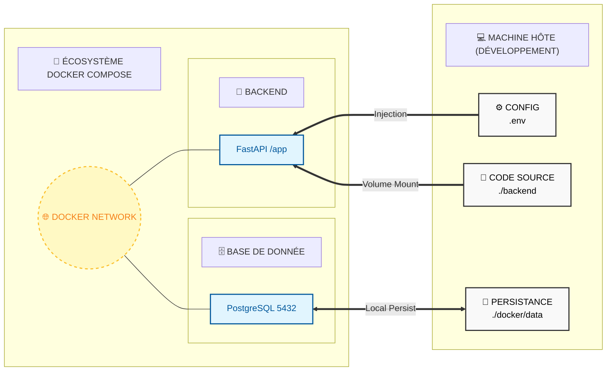

# 🐳 Infrastructure Docker

Ce projet utilise Docker pour garantir un environnement de développement identique pour tous les contributeurs et simplifier le déploiement.

## 📊 Schéma d'Orchestration

---

## 🛠️ Services Docker Compose

Le fichier `docker-compose.yml` définit deux services principaux :

### 1. Base de données (`db`)
- **Image** : `postgres:17-alpine` (Légère et sécurisée).
- **Port** : Expose le port `5432` sur l'hôte.
- **Persistance** : Les données sont stockées dans le dossier local `./docker/postgres_data`.
- **Configuration** : Utilise le fichier `backend/.env` pour les identifiants.

### 2. Backend API (`backend`)
- **Build** : Construit à partir du `Dockerfile` situé dans `./backend`.
- **Port** : Accès via le port `8000`.
- **Volumes** : Le code source est monté (`./backend:/app`) pour permettre le **hot-reload** (les changements de code sont appliqués sans redémarrer le conteneur).
- **Dépendance** : Attend que le service `db` soit prêt avant de démarrer.

---

## 📡 Réseau et Communication

Les conteneurs communiquent entre eux via un réseau interne créé par Docker Compose.
- Pour que le backend se connecte à la base de données, il utilise l'hôte **`db`** (défini dans la variable `POSTGRES_SERVER`).

---

## 💾 Persistance des données

Le dossier `./docker/` à la racine contient les données de la base de données PostgreSQL. 
- **⚠️ Sécurité** : Ce dossier est exclu de Git (`.gitignore`). Ne le supprimez pas manuellement sauf si vous souhaitez réinitialiser complètement votre base de données locale.
- **Permissions** : Sous Linux, ces fichiers appartiennent souvent à l'utilisateur `root` (démon Docker).

---

## ⌨️ Commandes Essentielles

| Action | Commande |
| :--- | :--- |
| Démarrer tout | `docker compose up -d` |
| Arrêter tout | `docker compose down` |
| Voir les logs | `docker compose logs -f` |
| Logs d'un service | `docker compose logs -f backend` |
| Redémarrer le back | `docker compose restart backend` |
| Entrer dans la DB | `docker compose exec db psql -U superadmin -d edupo_db` |

---

## 🚀 Vers la Production

Pour la production, le comportement des volumes et du hot-reload doit être adapté. Le `Dockerfile` du backend doit être optimisé pour ne pas inclure les fichiers de développement (outils de test, docs, etc.).
